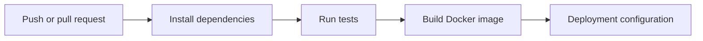

# Nexus DevOps Platform

An end-to-end learning project for building and validating a cloud-native delivery path around a small Node.js API.

## What is implemented

- Express API with `/`, `/health`, and `/api/info` endpoints
- Automated Node.js tests
- Docker image and local Docker Compose service
- GitHub Actions workflow that installs dependencies, runs tests, and builds the image
- Kubernetes Deployment and Service manifests with health probes and resource limits
- Helm chart and an Argo CD Application manifest
- Terraform configuration for an AWS ECR repository
- Ansible playbook for basic host setup
- Prometheus, Loki, and Alloy configuration examples

The repository contains deployment and infrastructure configuration. It does not claim that the Kubernetes manifests, Terraform, Ansible, or observability stack have been applied to a live production environment.

## Delivery flow



## Run locally

Prerequisites: Docker with the Compose plugin, or Node.js 24+ and npm.

Start the API with Docker Compose:

```bash
docker compose up --build
```

In another terminal, check the API:

```bash
curl http://localhost:3000/
curl http://localhost:3000/health
curl http://localhost:3000/api/info
```

Stop the service with `Ctrl+C`, then run:

```bash
docker compose down
```

To test without Docker:

```bash
cd app
npm ci
npm test
npm start
```

The local API listens on port 3000 by default.

## Build the image directly

From the repository root:

```bash
docker build -t nexus-api:local .
docker run --rm -p 3000:3000 nexus-api:local
```

## CI

The workflow at [`.github/workflows/ci.yml`](.github/workflows/ci.yml) runs on pushes to `main` and `feature/**`, and on pull requests targeting `main`. It runs `npm ci`, `npm test`, and `docker build`. Check the [Actions history](../../actions) for recorded run results.

## Infrastructure and deployment files

| Area | Path | What it demonstrates |
|---|---|---|
| Container | `Dockerfile`, `docker-compose.yml` | Image build and local service |
| Kubernetes | `kubernetes/` | Deployment, probes, and Service |
| Helm | `helm/nexus-api/` | Parameterized Kubernetes resources |
| GitOps | `gitops/nexus-application.yaml` | Argo CD Application configuration |
| AWS | `terraform/main.tf` | ECR repository only |
| Host setup | `ansible/setup-nexus.yml` | Basic package and directory setup |
| Observability | `monitoring/` | Prometheus, Loki, and Alloy configuration examples |

Terraform uses the `eu-west-1` region and creates an ECR repository. Applying it requires AWS credentials and may incur AWS charges. No cloud deployment is required for the local application and CI steps above.

## Current scope

This is a portfolio learning project. Local API tests, image builds, and GitHub Actions runs provide execution evidence. The cloud and cluster files are configuration examples; use the steps above to reproduce the local path, and inspect the linked workflow runs for CI evidence.
